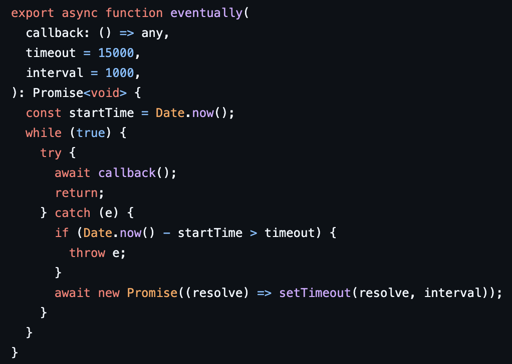
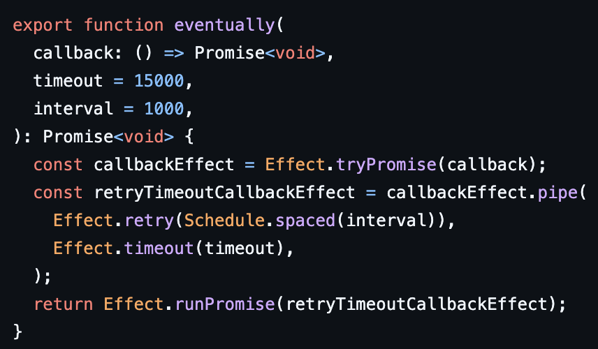
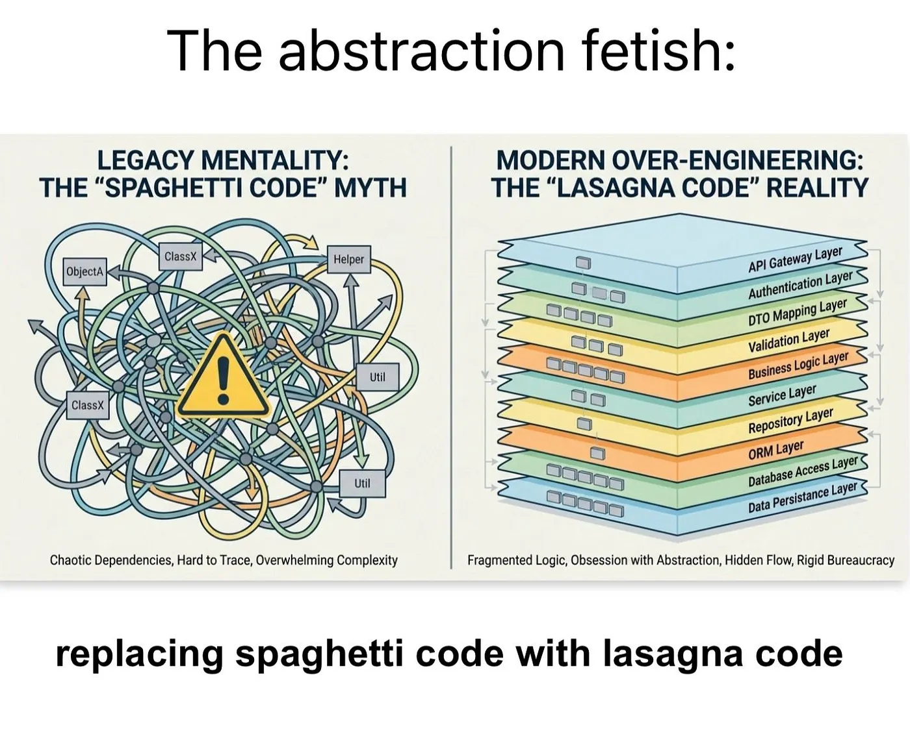
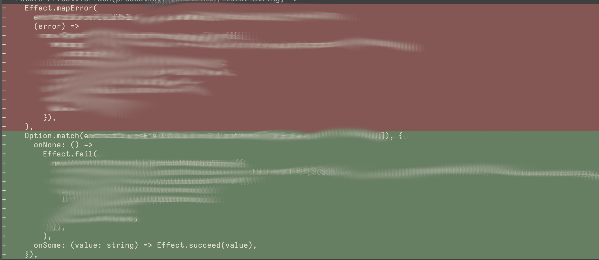

#+OPTIONS: toc:nil num:nil
#+REVEAL_TRANS: fade
#+REVEAL_TITLE_SLIDE: <h1>Effect TS Introduction</h1>
#+REVEAL_EXTRA_CSS: ./EffectTS.css
* Audience
:PROPERTIES:
:HTML_CONTAINER_CLASS: left-text
:END:
✅ If you are new to:
- Functional Programming
- Effect System
- New to ~effect-ts~
❌ If you know
- ZIO/Cats Effect
- Haskell or a similar FP language
* Goals
1. Core Concepts
2. Core Components
3. Read/Review ~effect-ts~ Code
4. Write Basic ~effect-ts~ Code
* When To Use
Whenever TypeScript is used
* Why

* Improved Type System and More
- Computations with Side Effects :: Referential Transparency Restored
- Computations as Values :: Execution Control
- Consistent Patterns :: Learn once, Use +Almost+ Everywhere
- Schema Validation :: Not Discussed Here
- Easier Common Scenarios :: Concurrency, Resource Management, Missing Values, Error Handling, Dependencies...
** Side-effectful function
:PROPERTIES:
:HTML_CONTAINER_CLASS: left-text
:END:

❌ Calling this is not equivalent to its value/type

💔 Loss of Referential Transparency

#+begin_src typescript
  function log(message: string): void {
      console.log(`Amazing log ${message}`);
  }

#+end_src
** Side-effectful function with Effect

- ✅ Referential Transparency Restored.
- 🆕 Return Type
- ~sync~ for *SAFE* Synchronous Computation
- Notice the Lambda Function Parameter

#+begin_src typescript
  import { Effect } from 'effect';

  function log(message: string): Effect.Effect<void> {
      return Effect.sync(() => console.log(`Amazing log ${message}`));
  }

#+end_src
** Computation As Values - Execution Control
#+begin_src typescript
   const program : Effect.Effect<void> =
   Effect.sync(() => console.log(`Amazing Program`));

  // Run synchronously
  Effect.runSync(program);

  // Run asynchronously
  Effect.runPromise(program);

  // Repeat the action 2 additional times after the first execution
  const programRepeated = Effect.repeatN(program, 2);
  Effect.runPromise(programRepeated);
#+end_src

* Composition
** Pipe - Pure Composition
no side effects; primitive type computations
#+begin_src fundamental
┌───────┐    ┌───────┐    ┌───────┐    ┌───────┐    ┌───────┐    ┌────────┐
│ input │───►│ func1 │───►│ func2 │───►│  ...  │───►│ funcN │───►│ result │
└───────┘    └───────┘    └───────┘    └───────┘    └───────┘    └────────┘
#+end_src
#+begin_src typescript
import { pipe } from "effect"

// Define simple arithmetic operations
const increment = (x: number) => x + 1
const double = (x: number) => x * 2
const subtractTen = (x: number) => x - 10

// Sequentially apply these operations using `pipe`
const result = pipe(5, increment, double, subtractTen)

console.log(result)
// Output: 2
#+end_src
** Map - Pure Computation Over "Context"

If you want to transform the result of the computation.

Similar to ~Promise.then~, but only with pure computations

#+begin_src typescript
    // No side effects inside the "then"
    fetch("https://example.org/products.json")
      .then((response) => response.status);
#+end_src

*** Example Option
#+begin_src typescript
  import { Option, pipe } from "effect";

  const mappedOption: Option.Option<number> = pipe(
    Option.some(42),
    Option.map((x: number) => x * 2),
  );
  console.log(mappedOption);
  // { _id: 'Option', _tag: 'Some', value: 84 }
  console.log(Option.getOrElse(mappedOption, () => 0));
  // 84
#+end_src
*** Example Effect
#+begin_src typescript
  import { Effect, pipe } from "effect";

  const mappedEffect: Effect.Effect<string> = pipe(
    Effect.succeed("data"),
    Effect.map((x: string) => `Awesome ${x}`),
  );
  // Awesome data
  console.log(Effect.runSync(mappedEffect));
#+end_src

** andThen
I don't care about your result

After that effect, do this

#+begin_src typescript
  import { Effect, pipe } from "effect";

  // Notice the return type!
  const mappedEffect: Effect.Effect<void> = pipe(
    Effect.succeed("data"),
    // works on pure functions as well. Multiple overloads
    Effect.andThen(() => Effect.sync(() => console.log(`Finished`))),
  );
  // Prints: Finished
  // Returns: void
  console.log(Effect.runSync(mappedEffect));
#+end_src

** zipRight (and zipLeft)
~zipRight~ Very similar to ~Promise.then~

You can decide which value to keep and what to discard. Both Effects are performed

#+begin_src typescript
  import { Effect, pipe } from "effect";

  const mappedEffect: Effect.Effect<void> = pipe(
    Effect.succeed("data"),
    Effect.zipRight(Effect.sync(() => console.log(`Finished`))),
  );

  console.log(Effect.runSync(mappedEffect));
#+end_src

** Tap
- Run a side-effect
- Value flowing through ~pipe~ stays available for the next step
#+begin_src typescript
  import { Effect, pipe } from "effect";

  const traced: Effect.Effect<string> = pipe(
    Effect.succeed("data"),
    Effect.tap(() => Effect.sync(() => console.log("In progress"))),
    Effect.map((data: string) => `awesome ${data}`),
  );
  // In progress  — log from tap runs first
  // awesome data — final mapped value
  console.log(Effect.runSync(traced));
#+end_src

** FlatMap - Chain of Effects
~Promise.then((v) => AnotherPromise)~
#+begin_src typescript
  import { Effect, pipe } from "effect";

  const mappedEffect: Effect.Effect<void> = pipe(
    Effect.succeed("data"),
    Effect.tap(() => Effect.sync(() => console.log(`In progress`))),
    Effect.flatMap((data: string) =>
      Effect.sync(() => console.log(`awesome ${data}`)),
    ),
  );
  // Prints: In progress → awesome data
  // Returns: void
#+end_src

** Composition At Scale
*** Back To Callback Hell!
#+begin_src typescript
import { Effect } from "effect"

const program =
  Effect.succeed(1).pipe(
    Effect.flatMap(n1 =>
      Effect.succeed(n1 + 1)
    ),

    Effect.flatMap(n2 =>
      Effect.succeed(n2 * 2)
    ),

    // nested pipeline starts here
    Effect.flatMap(n3 =>
      Effect.succeed(n3).pipe(
        Effect.flatMap(x =>
          Effect.succeed(x + 10)
        ),
        Effect.flatMap(x =>
          Effect.succeed(x * 3)
        ),
        Effect.flatMap(x =>
          Effect.succeed(x - 5)
        )
      )
    ),

    Effect.flatMap(n4 =>
      Effect.succeed(n4 / 2)
    ),

    Effect.flatMap(n5 =>
      Effect.succeed(n5 + 7)
    ),

    Effect.flatMap(n6 =>
      Effect.succeed(`Final result: ${n6}`)
    )
  )
#+end_src
*** Does This Ring a Bell?
#+begin_src typescript
  connectToDatabase()
    .then((database) =>
      getUser(database)
        .then((user) =>
          getUserSettings(database)
            .then((settings) =>
              enableAccess(user, settings)
            ),
        ),
    );
#+end_src

*** Problem Already Solved
**** Scala for comprehension
#+begin_src scala
  for {
    _ <- logger.logInfo("Access DB")
    database <- connectToDatabase()
    _ <- logger.logInfo("Get Users")
    user <- getUser(database)
    _ <- logger.logInfo("Get User Settings")
    settings <- getUserSettings(database)
    _ <- logger.logInfo(s"Enable Access to $user")
    result <- enableAccess(user, settings)
  } yield result
#+end_src

**** Haskell do blocks
#+begin_src haskell
  do
    logInfo logger "Access DB"
    database <- connectToDatabase
    logInfo logger "Get Users"
    user <- getUser database
    logInfo logger "Get User Settings"
    settings <- getUserSettings database
    logInfo logger $ "Enable Access to " ++ show user
    return (enableAccess user settings)
#+end_src

**** Async/Await
#+begin_src typescript
  async function run() {
    logger.logInfo('Access DB');
    const database = await connectToDatabase();
    logger.logInfo('Get Users');
    const user = await getUser(database);
    logger.logInfo('Get User Settings');
    const settings = await getUserSettings(database);
    logger.logInfo(`Enable Access to ${user}`);
    const result = await enableAccess(user, settings);
    return result;
  }
#+end_src

*** Effect.gen and yield*
#+begin_src typescript
  // Each step is an effect
  Effect.gen(function* () {
    yield* logger.logInfo('Access DB');
    const database = yield* connectToDatabase();
    yield* logger.logInfo('Get Users');
    const user = yield* getUser(database);
    yield* logger.logInfo('Get User Settings');
    const settings = yield* getUserSettings(database);
    yield* logger.logInfo(`Enable Access to ${user}`);
    const result = yield* enableAccess(user, settings);
    return result;
  })
#+end_src
*** Simulating do notation

Very similar to the generators

** It's Just the Beginning
- ~all~
- ~forEach~
- ~when~ - ~unless~
- ~whenEffect~ - ~unlessEffect~
- ~tapError~ - ~mapError~
- ~both~

  ...
* Effect
The core datatype for impure computations and beyond

#+begin_src
         ┌─── Represents the success type
         │        ┌─── Represents the error type
         │        │      ┌─── Represents required dependencies
         ▼        ▼      ▼
Effect<Success, Error, Requirements>
#+end_src

*** Dependencies Channel
- Declare Your Dependencies
- Consider Them Satisfied
- Use Them
- Provide Them Later

  #+begin_src
                         ┌─── Represents required dependencies
                         ▼
Effect<Success, Error, Requirements>
  #+end_src

**** Why Does This Work? Laziness!!!
- Declare your effects
- Compose and prepare them
- Run Everything Everywhere All at Once

  /at the end of the world/
**** Dependencies Declaration, Retrieval and Usage
- Declare a Random class dependency

  Usually a class/interface

- It is fetched from the context and used
- Where does it come from? 🤷
#+begin_src typescript
const program: Effect<void, never, Random> = Effect.gen(function* () {
  const random = yield* Random
  const randomNumber = yield* random.next
  console.log(`random number: ${randomNumber}`)
})
#+end_src

**** Dependencies Fulfilment

#+begin_src typescript
  // Providing the implementation
  //
  //      ┌─── Effect<void, never, never>
  //      ▼
  const runnable = Effect.provideService(program, Random, {
    next: Effect.sync(() => Math.random()),
  });

  // Run successfully
  Effect.runPromise(runnable);
  /*
    Example Output:
    random number: 0.8241872233134417
  */
#+end_src
**** Benefits

- Testability :: Can Swap With Mocks
- Reasoning :: without implementation details
- Separation of Concerns ::

*** Error Handling Channel
#+begin_src
                  ┌─── Represents the error type
                  │
                  ▼
Effect<Success, Error, Requirements>
#+end_src

The ones we /Expect/
**** Expected Errors
***** Declare "Tagged" Expected Errors

/Tag/ is used throughout Effect to identify components

#+begin_src typescript
  // Define a custom error type using Data.TaggedError
  class HttpError extends Data.TaggedError("HttpError")<{
    cause: unknown;
  }> {}
#+end_src
***** Returning Tagged Errors

#+begin_src typescript
//      ┌─── Effect<string, HttpError, never>
//      ▼
const program = Effect.gen(function* () {
  // Generate a random number between 0 and 1
  const n = yield* Random.next

  // Simulate an HTTP error
  if (n < 0.5) {
    return yield* Effect.fail(new HttpError())
  }

  return "some result"
})
#+end_src

***** Notes
- Multiple Errors ::

  #+BEGIN_SRC typescript
    Effect<string, HttpError | ValidationError, never>
  #+END_SRC

- Short Circuiting :: Stop execution upon encountering the first error.
- Collecting errors is possible with other abstractions
**** Defects
Errors thrown and unexpected:
- Not visible at type system
- Part of the /Effect/ type semantic
**** Handlers
You can decide what and when to handle.

You are forced to handle expected errors

You should handle defects

***** Expected Errors
****** CatchTags

Use the previous error tag to handle it/them

#+begin_src typescript
  //      ┌─── Effect<string, never, never>
  //      ▼
  const recovered2 = program.pipe(
    Effect.catchTags({
      HttpError: (_HttpError) => Effect.succeed(`Recovering from HttpError`),
      ValidationError: (_ValidationError) =>
        Effect.succeed(`Recovering from ValidationError`),
    }),
  );
#+end_src
***** Defects
****** Cause

Store various details such as:

- Unexpected errors or defects
- Stack and execution traces
- Reasons for fiber interruptions

****** catchAllCause

#+begin_src typescript
// Recover from all errors by examining the cause
const recovered = program.pipe(
  Effect.catchAllCause((cause) =>
    Cause.isFailType(cause)
      ? Effect.succeed("Recovered from a regular error")
      : Effect.succeed("Recovered from a defect")
  )
)
#+end_src
****** Exit

- Datatype to signal the termination: =Success= or =Failure=
- The wrapped error being a =Cause=
- Describes how an Effect terminates

****** Effect.Exit

A way to move the error to the value

#+begin_src typescript
Effect<A, E, R> -> Effect<Exit<A, E>, never, R>
#+end_src

****** catchAllDefect - Catch ONLY Defects

#+begin_src typescript
const program = Effect.catchAllDefect(riskyTask, (defect) => {
  if (Cause.isRuntimeException(defect)) {
    return Console.log(
      `RuntimeException defect caught: ${defect.message}`
    )
  }
  return Console.log("Unknown defect caught.")
})
#+end_src

***** catchAll

General handler getting a =error : unknown= handler

Hard to know what that error could be

#+begin_src typescript
//      ┌─── Effect<string, never, never>
//      ▼
const recovered = program.pipe(
  Effect.catchAll((error) =>
    Effect.succeed(`Recovering from ${error._tag}`)
  )
)
#+end_src
* Popular Convenient Data Types
** Either
- Pure error handling type
- Similar to =Exit= but for any type
- Composed of:
  - =Either.Left= (error)
  - =Either.Right= (value)
- Has all composition patterns seen before
- Use when your computation:
  - Has no side-effects
  - Can fail
** Match
- For FP coders :: +worse+ Pattern matching
- For TypeScript developers :: Better =switch=
*** Value Match

#+begin_src typescript
// Simulated dynamic input that can be a string or a number
const input: string | number = "some input"

//      ┌─── string
//      ▼
const result = Match.value(input).pipe(
  // Match if the value is a number
  Match.when(Match.number, (n) => `number: ${n}`),
  // Match if the value is a string
  Match.when(Match.string, (s) => `string: ${s}`),
  // Ensure all possible cases are covered
  Match.exhaustive
)
#+end_src
**** Several Possible Conditions
#+begin_src typescript
  // Match when age is greater than 18
  Match.when({ age: (age) => age > 18 }, (user) => `Age: ${user.age}`),
  // Match when age is exactly 18
  Match.when({ age: 18 }, () => "You can vote"),
  // Match any value except "hi", returning "ok"
  Match.not("hi", () => "ok"),
  // Match either "fetch" or "success"
  Match.tag("fetch", "success", () => `Ok!`),
  // Fallback case for when the value is "hi"
  Match.orElse(() => "fallback")
#+end_src
*** Type Match

#+begin_src typescript
// Create a matcher for values that are either strings or numbers
//
//      ┌─── (u: string | number) => string
//      ▼
const match = Match.type<string | number>().pipe(
  // Match when the value is a number
  Match.when(Match.number, (n) => `number: ${n}`),
  // Match when the value is a string
  Match.when(Match.string, (s) => `string: ${s}`),
  // Ensure all possible cases are handled
  Match.exhaustive
)

console.log(match(0))
// Output: "number: 0"

#+end_src

*** withReturnType

*Highly Recommended*

Ensures the match will return that type
#+begin_src typescript
const match = Match.type<{ a: number } | { b: string }>().pipe(
  // Ensure all branches return a string
  Match.withReturnType<string>(),
  // ❌ Type error: returns a number
  Match.when({ a: Match.number }, (_) => _.a),
// Error ts(2322) ― Type 'number' is not assignable to type 'string'.
// ✅ Correct: returns a string
  Match.when({ b: Match.string }, (_) => _.b),
  Match.exhaustive
)
#+end_src

*** Exhaustive

*Highly Recommended*

Ensures all possible cases are covered

#+begin_src typescript
// Create a matcher for string or number values
const match = Match.type<string | number>().pipe(
  // Match when the value is a number
  Match.when(Match.number, (n) => `number: ${n}`),
  // Mark the match as exhaustive, ensuring all cases are handled
  // TypeScript will throw an error if any case is missing
  Match.exhaustive
)

// Fail at compile time, string is not handled.

#+end_src

** Stream
- Known Composition Patterns
- Integrates with the =Effect= Type
- Error Channel
- Node Streams Interoperability
- *Rich API*: Grouping - Partitioning - Interleaving - Interspersing - Scheduling - Debouncing - Throttling ...
** Retry / Scheduler / Timeout Example
*** Before

*** After

* Architecture
 
** Main Components

| Concept | Description                                                                       |
|---------+-----------------------------------------------------------------------------------|
| service | A reusable component providing specific functionality                             |
| tag     | A unique identifier representing a service, allowing Effect to locate and use it. |
| context | A collection storing services                                                     |
| layer   | An abstraction for constructing services                                          |

** Services
**** Define A Service
#+begin_src typescript
import { Effect, Context } from "effect"

// Declaring a tag for a service that generates random numbers
class Random extends Context.Tag("MyRandomService")<
  Random,
  { readonly next: Effect.Effect<number> }
>() {}
#+end_src
**** Provide Implementation

#+begin_src typescript
  export const RandomLive = Effect.succeed({
    next: Effect.sync(() => Math.random())
  })
#+end_src
**** Using The Service
#+begin_src typescript
//      ┌─── Effect<void, never, Random>
//      ▼
const program = Effect.gen(function* () {
  const random = yield* Random
  const randomNumber = yield* random.next
  console.log(`random number: ${randomNumber}`)
})
#+end_src
**** Providing Service

- Simple Way
- Does Not Scale
- Useful for Simple Cases
- You want to provide ONE dependency on the spot

#+begin_src typescript
  const runnable = Effect.provideService(program, Random, {
    next: Effect.sync(() => Math.random())
  });
  Effect.runPromise(runnable)
#+end_src
*** Effect.Service
- Another Way to Create Services
- Provide definition, implementation and dependencies in one place
- Automatically Generates Layers
*** Built-in Services

- No need to explicitly provide their implementations
- No setup
- Overrideable

#+begin_src typescript
  type DefaultServices =
      Clock
      | ConfigProvider
      | Console
      | Random
      | Tracer
#+end_src

** Layers
When the creation:
- Can Be Effectful
- Can fail
- Can have requirements

  #+begin_src
        ┌─── The service to be created
        │                ┌─── The possible error
        │                │      ┌─── The required dependencies
        ▼                ▼      ▼
Layer<RequirementsOut, Error, RequirementsIn>
  #+end_src
**** Creating Layer
#+begin_src typescript
  const randomLayer = Layer.effect(
    Logger,
    Effect.gen(function* () {
      const config = yield* Config
      return {
        next: Effect.gen(function* () {
          const seed = yield* config.getSeed();
          return Math.random(seed);
        })
      }
    });
#+end_src

**** Composing Layer
#+begin_src typescript
  const AppConfigLive = Layer.merge(ConfigLive, LoggerLive);
  const MainLive = DatabaseLive.pipe(
    Layer.provide(AppConfigLive),
    Layer.provide(ConfigLive),
  );
#+end_src
**** Providing Layer
#+begin_src typescript
  // I give you the whole structure
  // You'll select the services you need based on the tags
  // They will be created for you following layer logic
  const runnable = Effect.provide(program, MainLive)

  Effect.runPromise(runnable).then(console.log)
#+end_src

** Context
*** Motivation

- You want a repository where all your services are
- Grab what you want
- Use it

*** Usual Service Setup
#+begin_src typescript
type Context = {
  databaseService: DatabaseService
  loggingService: LoggingService
}

const processData = (data: Data, context: Context) => {
  // Using multiple services from the context
}
#+end_src
*** Problem
The environment must be correctly set up with all necessary services first
- Tightly coupled code
- Functional composition and testing more difficult
- May just need one service out of 100

*** Solution
Conceptually: ~type Context = Map<Tag, Service>~
Remember laziness
*** Extract Service Type
#+begin_src typescript
type RandomShape = Context.Tag.Service<Random>
/*
This is equivalent to:
type RandomShape = {
    readonly next: Effect.Effect<number>;
}
*/
#+end_src
*** Build and use Context
#+begin_src typescript
// Combine service implementations into a single 'Context'
const context = Context.empty().pipe(
  Context.add(Random, { next: Effect.sync(() => Math.random()) }),
  Context.add(Logger, {
    log: (message) => Effect.sync(() => console.log(message))
  })
)

// Provide the entire context
const runnable = Effect.provide(program, context)
#+end_src
* Ecosystem & More
- Adaptable to different platforms: =node=, =bun=, =browser=
- Http: =client=, =routes=, =OpenApi=, =RPC=
- Schema Validation
- =@effect/opentelemetry=
- =@effect/cli=
- Configuration
- Memoization / Cache
* Downsides
** Syntax / Verbosity

Especially over simple computations

#+begin_src typescript
  const vanillaName = user.name ?? 'John';
  const vanillaSurname = user.surname ?? 'Doe';
  const vanillaResult = `${vanillaName} ${vanillaSurname}`;

  const optionResult =
    Option.zipWith(
      user.name,
      user.surname,
      (name, surname) => `${name} ${surname}`
    ).pipe(
      Option.getOrElse(() => 'John Doe')
    )
#+end_src

** Type Gymnastics

Complex Types → Complex Compilation Errors

** Beware of AI

Probably fixable with some good prompts/skills

Still good to solve common compilation problems

*** Example 1 - Useless Steps
#+begin_src typescript
    pipe(
      ...
      Stream.zipWithIndex,
      // Stream.map(
      //   ([record, rowIndex]: [Record<string, string>, number]): CsvRow =>
      //      [record, rowIndex],
      // ),
      ...
    )
#+end_src

*** Example 2 - Love for Option.Match
- Rewrite to ~Option.match~ unnecessary
- ~ElementNotFound~ error lost
  
*** Example 3 - Shortcuts

/Please add returns types to functions/

#+begin_src typescript
  ...
  // eslint-disable-next-line @typescript-eslint/explicit-module-boundary-types -- Effect Layer inference
  export function fooLayer() {
    ...
  }
#+end_src

#+html: <video preload="auto" loop="" autoplay="" id="content" width="300" height="300"><source src="https://media.tenor.com/ZfhT82UtSCkAAAPo/yes-man-no-man.mp4" type="video/mp4"><source src="https://media.tenor.com/ZfhT82UtSCkAAAPs/yes-man-no-man.webm" type="video/webm"></video>

* References
- [[https://zio.dev/][ZIO]]
- [[https://effect.website/docs/][Effect Colloquial Docs]]
- [[https://effect-ts.github.io/effect/][Effect Detailed Docs]]
